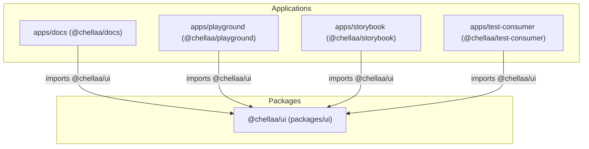

# Chellaa UI — Monorepo Architecture

## 1. Why Chellaa UI Uses a Monorepo

Chellaa UI utilizes an **NPM Workspaces Monorepo** architecture to separate concerns between:
1. **Reusable Core Package (`packages/ui`)**: The consumable `@chellaa/ui` design system and UI primitive library.
2. **Deployable Applications (`apps/*`)**: Documentation portal (`apps/docs`), Interactive Workbench (`apps/playground`), Component Storybook (`apps/storybook`), and Consumer Validation harness (`apps/test-consumer`).
3. **CI/CD & Repository Automation (`.github/`)**: Automated verification pipeline ensuring type-safety, linting, unit tests, and production compilation.

---

## 2. Monorepo Directory Structure

```text
chellaa-ui/
│
├── apps/
│   ├── docs/             # Vite SPA hosting interactive documentation portal
│   │   ├── src/DocsView.tsx
│   │   ├── src/main.tsx
│   │   ├── package.json
│   │   ├── vite.config.ts
│   │   └── tsconfig.json
│   │
│   ├── playground/       # Vite SPA hosting design system workbench
│   │   ├── src/PlaygroundView.tsx
│   │   ├── src/main.tsx
│   │   ├── package.json
│   │   ├── vite.config.ts
│   │   └── tsconfig.json
│   │
│   ├── storybook/        # Standalone Storybook 8 application
│   │   ├── .storybook/main.ts
│   │   ├── .storybook/preview.tsx
│   │   └── package.json
│   │
│   └── test-consumer/    # External consumer validation test harness
│       ├── src/App.tsx
│       ├── src/main.tsx
│       ├── package.json
│       ├── vite.config.ts
│       └── tsconfig.json
│
├── packages/
│   └── ui/               # Core @chellaa/ui library package
│       ├── src/
│       │   ├── components/  # 35 UI component suites (6-file anatomy)
│       │   ├── theme/       # ThemeProvider, useTheme, tokens
│       │   ├── hooks/       # useFocusTrap, useControlled, useId, useOutsideClick
│       │   ├── utils/       # cn (clsx + tailwind-merge)
│       │   ├── styles/      # index.css (Tailwind base + semantic tokens)
│       │   └── index.ts     # Main public library export
│       ├── dist/            # Compiled artifacts (ESM, CJS, DTS, styles.css)
│       ├── package.json     # name: "@chellaa/ui", peerDeps: react, react-dom
│       ├── vite.config.ts   # Library mode (ESM, CJS, styles.css)
│       ├── vitest.config.ts # Component test suite (480 unit tests)
│       ├── tsconfig.json
│       ├── tsconfig.build.json
│       └── tailwind.config.js
│
├── .github/
│   └── workflows/ci.yml  # Monorepo CI verification pipeline
│
├── package.json          # Root private npm workspaces ["apps/*", "packages/*"]
├── tsconfig.json         # Root project references config
├── eslint.config.js      # Strict ESLint configuration
├── .prettierrc           # Formatting rules
├── README.md             # Monorepo overview and developer guide
└── ARCHITECTURE.md       # Comprehensive architectural documentation
```

---

## 3. Dependency Graph & Boundary Enforcement



### Strict Boundary Rules:
- **Applications consume `@chellaa/ui`** through npm workspace resolution (`import { Button } from "@chellaa/ui"` and `import "@chellaa/ui/styles.css"`).
- **No relative cross-boundary imports**: Applications never import from `../../packages/ui/src`.
- **Strict single-direction dependencies**: `@chellaa/ui` never imports anything from `apps/*`.
- **Externalized React**: `react` and `react-dom` are `peerDependencies` in `@chellaa/ui` and are not bundled into the library build.

---

## 4. Reusable UI Package Architecture (`@chellaa/ui`)

### 4.1 Strict 6-File Component Standard
Every component suite in `packages/ui/src/components/` adheres to the strict 6-file convention:
```text
ComponentName/
├── ComponentName.tsx          # Accessible React component implementation
├── ComponentName.types.ts     # Strict TypeScript props (0 any types)
├── ComponentName.variants.ts  # Tailwind CVA variants
├── ComponentName.test.tsx     # Vitest & RTL test suite
├── ComponentName.stories.tsx  # Storybook stories
└── index.ts                   # Component barrel export
```

### 4.2 Build Outputs (`packages/ui/dist/`)
- `dist/index.js`: ECMAScript Module (ESM) bundle for modern bundlers (Vite, Webpack, Rollup).
- `dist/index.cjs`: CommonJS (CJS) bundle for Node.js / legacy environments.
- `dist/index.d.ts`: TypeScript declaration maps for autocomplete and compile-time type validation.
- `dist/styles.css`: Precompiled, zero-purge Tailwind CSS containing all design system utility classes and HSL variables.

---

## 5. Theme & Design Tokens

Chellaa UI provides a token-driven theming engine:
- **HSL CSS Variables**: Mapped via `@layer base` in `packages/ui/src/styles/index.css`.
- **Theme Modes**: Supports `light`, `dark`, and `system` modes.
- **Dynamic Token Overrides**: `ThemeProvider` accepts runtime token overrides through `customTokens` which are injected directly into the DOM root.

---

## 6. Zero-Purge Tailwind Distribution

Consumers of `@chellaa/ui` do **not** need to install or configure Tailwind CSS:
```tsx
import { Button } from "@chellaa/ui";
import "@chellaa/ui/styles.css"; // Includes all tokens and utility classes
```
All utility classes used across all 35 components are compiled into `packages/ui/dist/styles.css`.

---

## 7. Testing Strategy

- **Vitest & React Testing Library**: All 480 unit tests run against `packages/ui` verifying WAI-ARIA roles, keyboard arrow navigation, focus traps, controlled/uncontrolled updates, and event callbacks.
- **Consumer Test Harness (`apps/test-consumer`)**: Verifies that external applications consuming `@chellaa/ui` and `@chellaa/ui/styles.css` compile cleanly without missing styles or broken typings.

---

## 8. Vercel Deployment Architecture Matrix

| Application | Monorepo Root Directory | Build Command | Output Directory |
| :--- | :--- | :--- | :--- |
| **`chellaa-ui-docs`** | `apps/docs` | `npm run build` | `dist` |
| **`chellaa-ui-playground`** | `apps/playground` | `npm run build` | `dist` |
| **`chellaa-ui-storybook`** | `apps/storybook` | `npm run build:storybook` | `storybook-static` |

---

## 9. Future Scaling & NPM Publishing

- **Ready for NPM Publishing**: `@chellaa/ui` contains proper `exports`, `main`, `module`, `types`, and `files: ["dist"]` manifests. Publishing is as simple as running `npm publish` from `packages/ui/`.
- **Turborepo / Nx Ready**: Workspace task pipelines (`build`, `test`, `lint`, `typecheck`) are deterministic and can be integrated with remote caching tools if needed as the team grows.
